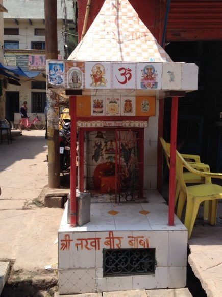

# Mandirs of Varanasi

An interactive map and spatial analysis of the "tiny temples" of Varanasi, India: 2,296 street shrines with full records, from a survey of 3,347 by Dr. Christian Haskett and Nathaniel Deaton in 2012 and 2015.

**Live site:** https://realcaddish.github.io/Mandirs-of-Varanasi/
**Findings and methods:** [ANALYSIS.md](ANALYSIS.md)
**Companion paper:** Haskett, C. (2018), *South Asia Multidisciplinary Academic Journal*, https://journals.openedition.org/samaj/4524



## What the site shows

- **Density**: shrines per 66-metre hexagon across the city (full survey, 3,313 grid records).
- **Hot spots**: Getis–Ord Gi* hot-spot analysis with a false-discovery-rate correction. One contiguous hot spot behind the ghats holds two-thirds of all shrines on under 3 km².
- **Individual shrines**: every attributed shrine, with highlighting by deity family (Shaiva, Hanuman, Ganesh, Goddess, Vaishnava, Folk, Other) and by structure (free-standing, wall niche, temple complex, tree-temple, tree, built-around).
- **Seven findings**, each with a chart, the statistic behind it and a plain-language note on how to read it: clustering (nearest neighbour, Clark–Evans, Ripley's L), hot spots (Moran's I, Gi*), the river gradient (distance bands, Mann–Whitney, Spearman), the pantheon (presence, lift), structure (chi-square, Cramér's V, residuals), core versus periphery, and images and names.
- A glossary of the statistical toolkit, the caveats, and downloads.

## Repository layout

```
index.html            the site (single page, no build step)
data/
  mandirs.geojson     2,296 shrines, cleaned attributes, river distance, hot-spot class
  mandirs.csv         the same as a flat table (field guide on the site)
  hex.geojson         hexagon grid with survey count, point count, Gi* z-score, hot-spot class
  ganga.geojson       river polygon (OpenStreetMap)
  landmarks.json      ghats and landmarks for labels (OpenStreetMap)
  stats.json          every statistic the page displays
  raw/                original shapefile, original hex grid, OSM extracts and Overpass queries
scripts/              the analysis pipeline (Python)
images/               photographs from the survey (web-sized)
```

## Running locally

The page loads its data with `fetch`, so it must be served over HTTP rather than opened as a file:

```
python -m http.server 8000
```

then open http://localhost:8000/.

## Rebuilding the data

```
pip install -r scripts/requirements.txt
python scripts/run_all.py
```

This recomputes every statistic from `data/raw/` and rewrites the files in `data/`. See [scripts/README.md](scripts/README.md).

## Background

Scholarship on sacred space in Hinduism has emphasised grand temples such as the Kashi Vishwanath as the primary sites of veneration. Yet the most numerous temples in the city are shelters of roughly a cubic metre, built into walls, set beneath trees, or standing on street corners, and they play an integral part in the daily religious life of the city. The survey recorded, for each shrine, its GPS position, the deities housed, the number of images present, its physical form, and its name where one existed. This project puts that database on a map and asks what the positions reveal: how tightly shrines cluster, how far the river's pull reaches, which deities keep company, and how a shrine's form follows its occupant.

## Credits and licences

Survey data © Christian Haskett and Nathaniel Deaton. River outline, ghat and landmark names © OpenStreetMap contributors, ODbL. Basemap tiles by Esri and OpenStreetMap contributors; imagery by Esri. Map built with Leaflet. Code licence: see [LICENSE](LICENSE).
